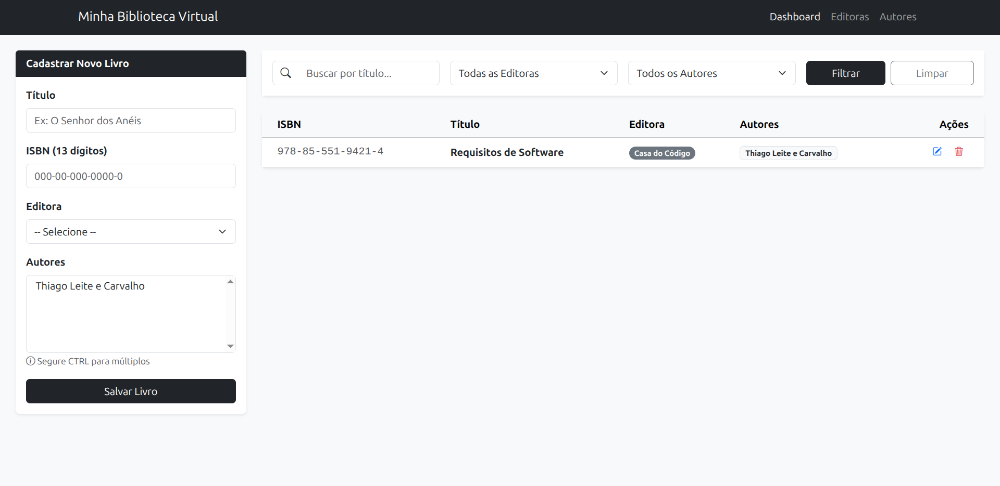
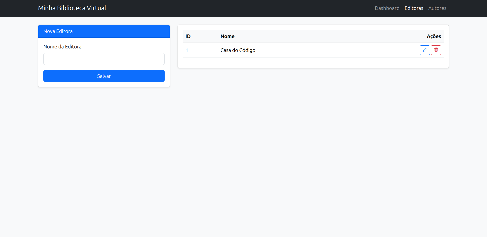
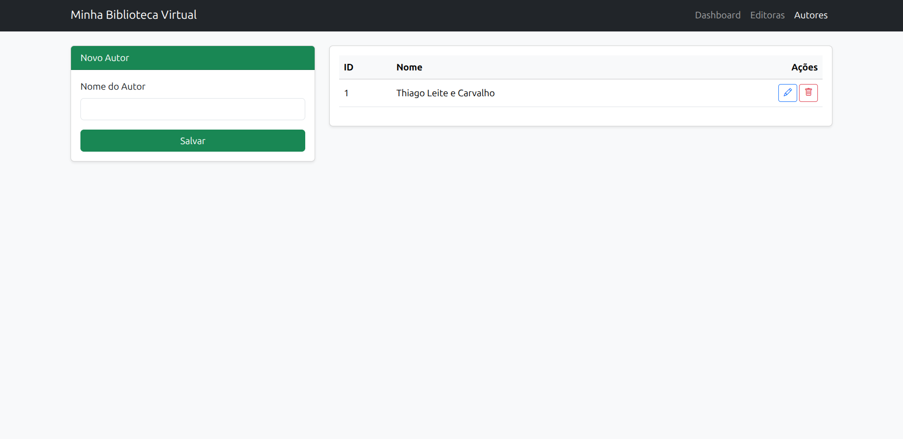
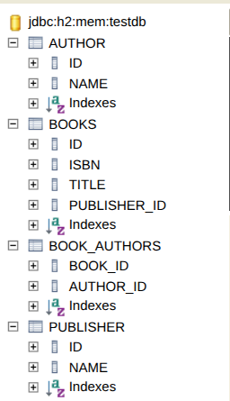

# Minha Biblioteca Virtual

Aplicação de gerenciamento de biblioteca desenvolvida para a disciplina de **IA Aplicada**, focada em demonstrar a integração de padrões de software modernos com auxílio de ferramentas de Inteligência Artificial.

## 👥 Integrantes (Alunos)
* **Davi Bezerra Marques**
* **Raimundo Avelino Gomes Lima**

## 🎯 Intuito da Disciplina de IA Aplicada
O intuito da disciplina é capacitar os alunos a utilizarem Large Language Models (LLMs) e outras ferramentas de IA como catalisadores de produtividade no ciclo de vida de software. O foco não é apenas a geração de código, mas o uso da IA para:
1. **Refatoração Estrutural:** Transformar códigos procedurais em arquiteturas limpas e orientadas a objetos.
2. **Resolução de Problemas Complexos:** Diagnosticar erros de stack trace e implementar correções de segurança e UX.
3. **Documentação e Padronização:** Garantir que o projeto siga padrões de mercado (Clean Code, SOLID).
4. **Engenharia de Prompts:** Desenvolver a habilidade de formular instruções estruturadas e contextuais para obter saídas de alta fidelidade da IA, garantindo que o código gerado ou refatorado respeite as restrições técnicas do projeto.

---

## 📂 Estrutura de Pastas e Organização
O projeto segue a estrutura padrão Maven com uma arquitetura em camadas (Layered Architecture):

```text
src/main/java/br/com/davimarques/library/
├── controller/     # Camada de Exposição: Controladores Web que gerenciam as rotas.
├── dto/            # Data Transfer Objects: Classes para transporte de dados (Records).
├── model/          # Camada de Domínio: Entidades JPA (Book, Author, Publisher).
├── repository/     # Camada de Persistência: Interfaces Spring Data JPA.
├── service/        # Camada de Negócio: Lógica, validações e formatação de dados.
└── LibraryApplication.java # Classe principal (Spring Boot).

src/main/resources/
├── static/         # Arquivos estáticos (CSS, JS).
└── templates/      # Páginas HTML renderizadas pelo Thymeleaf.
```

## 🚀 Funcionalidades do Projeto
Gestão de Livros (Dashboard): Cadastro, edição e exclusão de obras literárias.

Busca em Tempo Real (AJAX): Filtro dinâmico por título, autor e editora na mesma tela, sem recarregamento de página.

Máscara de ISBN Inteligente: Formatação automática (000-00-000-0000-0) tanto no front-end (JavaScript) quanto no back-end (Java), garantindo integridade dos dados.

Gestão de Autores e Editoras: Módulos independentes com validação de nomes duplicados (case-insensitive).

Ordenação Parametrizada: Listagens organizadas de forma crescente por ID para facilitar o rastreio de cadastros.

## 🛠️ Tecnologias Utilizadas
### Back-end
1. Java 21: Linguagem base utilizando Records para DTOs.

2. Spring Boot 3: Framework para agilidade no desenvolvimento e injeção de dependência.

3. Spring Data JPA: Abstração da camada de persistência.

4. H2 Database: Banco de dados em memória para execução rápida em ambiente de teste.

5. Lombok: Para redução de código boilerplate.

### Front-end
1. Thymeleaf: Engine de templates para integração Java/HTML.

2. Bootstrap 5: Framework CSS para design responsivo e moderno.

3. Bootstrap Icons: Conjunto de ícones para ações de sistema (editar, excluir, buscar).

4. JavaScript (Vanilla): Lógica de busca assíncrona (Fetch API) e máscaras dinâmicas.

## 📋 Como Rodar o Projeto
1. Pré-requisitos: Ter o Java 21 (ou superior) e o Maven instalados.

2. Clonagem: Clone o repositório para sua máquina local.

3. Execução: Na raiz do projeto, execute o comando:

4. Bash
./mvnw spring-boot:run
(No Windows, use mvnw.cmd spring-boot:run)

5. Acesso: Abra o navegador e acesse: http://localhost:8080/books

6. Banco de Dados (Console H2): Caso queira visualizar as tabelas, acesse http://localhost:8080/h2-console.

---

## 📸 Demonstração do Sistema (Telas)

### 1️⃣ Tela Dashboard (Gestão de Livros)
Módulo para cadastro e gerencimanto de livros.


### 2️⃣ Tela de Editoras
Módulo para cadastro e gerenciamento das editoras.


### 3️⃣ Tela de Autores
Módulo para cadastro e gerenciamento dos autores.


### 4️⃣ Estrutura do Banco de Dados (H2 Console)
Visualização das tabelas (`BOOK`, `AUTHOR`, `PUBLISHER`) geradas automaticamente pelo Hibernate a partir das Entidades JPA.


---